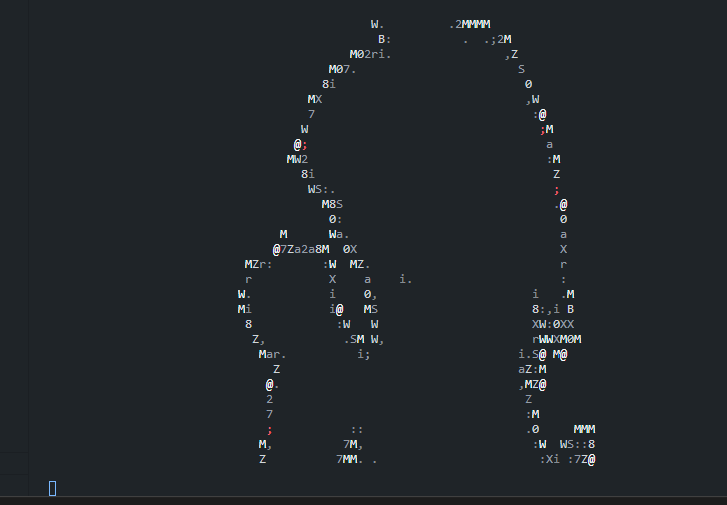

<h1 align="center">Console Bad-Apple in Node.js</h1>

<div align="center">
  
</div>

## Installation and launch
**Cloning the slokaln repository project**
```Bash
git clone https://github.com/DKMFzF/bad-apple-node.js.git
```

**Going to the project directory**
```Bash
cd bad-apple-node.js
```

**Locking up third-party libraries**
```Bash
npm install
npm run start
```

or

```Bash
yarn
yarn start
```

## Assembly

```
npm run start
```

or

```
yarn start
```

## Use libs in a project

- [ascii-art](https://www.npmjs.com/package/ascii-art)
- [play-sound](https://www.npmjs.com/package/play-sound)